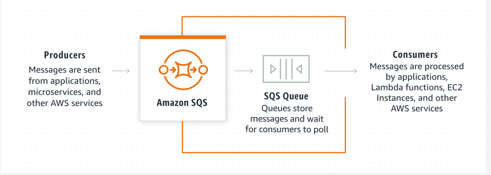
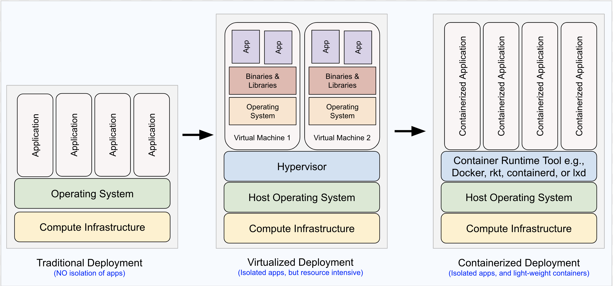

# Messaging & Containers

## Messaging in the cloud 
There are often times that users of your applications need to be notified when certain events happen. Notifications such as text messages or emails can sent through services in the cloud. the use of the cloud offers benefits like lowered costs, increased storage and flexibility.

## Amazon Simple Notification Service (SNS)
Amazon Simple Notification service (SNS) is a cloud service that allows you to send notifications to the users of your applications. SNS allows you to decouple the notification logic from being  embedded in your applications and allows notifications to be published to a large number of subscribers.

### Features
- SNS uses a publish/subscribe model.
- SNS can publish message to Amazon SQS queues, AWS Lamada functions and Http/s webhootks

### Tips 
- SNS topic names are limited to 256 characters.
- A notification can contain only one message.

## Queues
A queue is a data structure that holds requests called messages. Messages in a queue are commonly processed in order, first in , first out (FIFO)

Messsaging queues improve:
- Preformance 
- Scalability 
- User experience

## Amazon Simple Queue service (SQS)
Amazon Simple Queue service (SQS) is a fully managed message queuing service that allows you to integrate queuing functionality in your application. SQS offers two types of message queues : Standard and FIFO

### Features
- send messages
- store messages
- receive messages

### Tips 
- FIFO queues support up to 3,000 messages per second with batching or up to 300 messages per second without batching 
- FIFO queues guarantee the ordering of messages. 
- Standard queues offer best-effort ordering but no guarantees.
- Standard queues deliver a message at least once, but occasionally more than one copy of a message is delivered.

>Amazon SQS is a service that hosts the queue of messages (requests and responses) from the decoupled application components. Have a quick look at this SQS workflow to understand it better.

>  A standard queue supports an unlimited number of transactions per second (TPS) for each API action (SendMessage, ReceiveMessage, or DeleteMessage). Whereas, FIFO queues support up to 3000 messages per second while strictly preserving the message order.

### Configuration details 
- Visibility timeout - the time-duration (0 seconds - 12 hours) after which a consumer message can become visible to the other consumers. Generally the consumer must process and delete a message from the queue.

- Message retention period - the duration (1 min - 14 days) for which the queue retains a message that does not get deleted. Amazon SQS will automatically delete messages that have been in a queue for more than specified period.

- Delivery Delay - the time (0 seconds - 15 mints) to intentionally delay the delivery of each (new) message added to the queue. According to AWS:
> if your consumers need additional time to process messages, you must delay each new message comming to the queue.

- Maximum message size - it should be between 1 KB and 256 KB

>Note: SQS pricing is based on the count and size of messages, and the interactions with Amazon S3 and the AWS Key Management Service.

[HOW SQS works](https://docs.aws.amazon.com/AWSSimpleQueueService/latest/SQSDeveloperGuide/sqs-how-it-works.html)

# Containers

## What is a Container?
Os level virtualization allows us to run multiple isolated process in parallel. A container is an isloated process that consists of the following items, all bundled into one package:
- the application code.
- the required dependencies (e.g liberaries, Utilities , configuration files),
- the nescessary runtime environment to run the application. 

Each container is an independent component that acan run on its own and be moved from environment to environment

## Benefit of containers 
- Containers make it easier for developer to create, and run applications on different hardware and platforms, quickly and easily.
- Containers share a single kernal and share application libraries.
- Containers cause a lower system overhead as compared to virtual machines.

## How to create Containers ?
serveral platforms (called container runtime/engines) allow us to create containers, A few such platforms are:

- [Docker](https://www.docker.com/products/container-runtime/)
- [CRI-O](https://cri-o.io/)
- [OpenVZ](https://openvz.org/)
- [Containerd](https://containerd.io/)

## Docker containers vs Virtual Machines 
There are several benefits of using Containers over VMs:
- Size : Containers are much smaller than Virtual machines(VM) and run as isolated processes versus virtualized hardware. VMs can be in GBs while containers are in MBs.
- Spped: Virtual Machines can be slow to boot and take minutes to lanuch. A container can spawn much more quickly typically in seconds.
- Composability: Containers are designed to be programmatically build and are defined as source code. Virtual Machines are often replicas of a conventional computer sustem.

## Docker 
Docker is a (container runtime) tool that helps to build, test and run containers. You can build containers locally using a command-line utility, Docker Desktop. if there are multiple containers running individual services of an application, you will need to use Docker Compose utility to specify dependent relationships between containers.

## Docker Image
an Image (or Docker Image) is a portable auto-generated template that contains a set of instructions to create a container. An Image can be instantiated multiple numbers of times to create multiple containers.

## Docker fils 
A text file containing commands to create an image in other words, Docker generates images by reading the commands from a DockerFile.

### Recommended Read
[What's a Container](https://www.docker.com/resources/what-container/)
[How to Get Started with docker](https://docs.docker.com/get-started/)

## What is Elastic Container Service (ECS) ?
ECS is an orchestration service used for automating deployment, scaling and managing of your containerized applications. ECS works well with docker containers by:
- launching and stopping Docker Containers
- scaling you application 
- querying the state of your applications

### Tips 
- You can schedule long-running applications, services, and batch processeses using ECS.
- Docker is the only container-runtime platform supported by Amazon ECS. Other container-runtime tools available in the insdustry are Rocket, LXD, OpenVZ, any a few more.

[ Docker basics for Amazon ECS](https://docs.aws.amazon.com/AmazonECS/latest/developerguide/create-container-image.html)

## How does Amazon ECS help?
Assume you have a multi-container application that you want to run on the cloud. You may also require to scale the containers automatically based on the incoming traffic in such a case.

Amazon ECS deploys, manages, and scales containers based on your resource needs and supports other AWS services like Elastic Load Balancing, EC2 security groups, EBS volumes, and IAM roles.

### Key terms related to Amazon ECS
1. Task definition: 
A task definition describes the application requirements concerning containers, such as the max amount of total CPU and memory used for the task (not for the individual container) and container definitions.
ECS offers to create a task definition using either the AWS Fargate or AWS EC2. AWS Fargate is priced based on the task size, whereas the EC2 service is priced based on computing resource usage.

2. ECS cluster : A cluster is a set of containers running task requests within an AWS region. A default cluster gets created when you create and run your first task definition.

3. Container agent : It is a utility that connects container instances to one of your clusters. Each container instance runs a container agent.

4. Container instance : A container instance is an EC2 instance that is registered into any of your ECS clusters.
