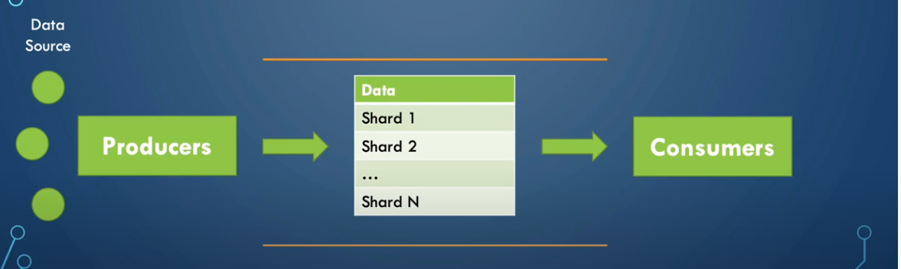
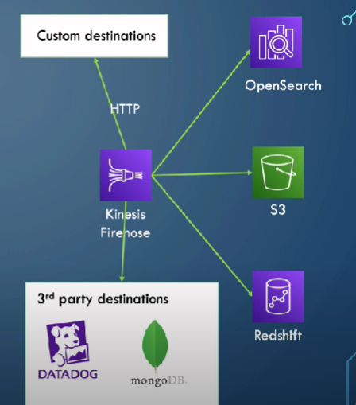
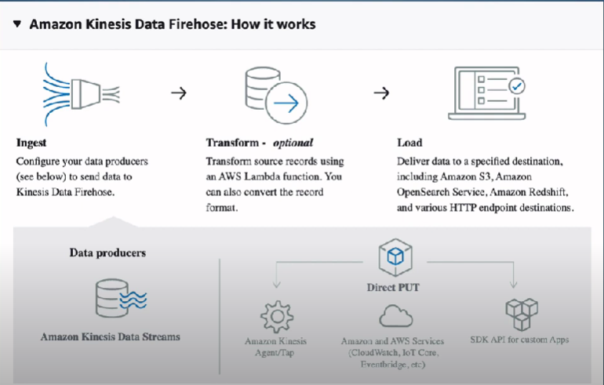
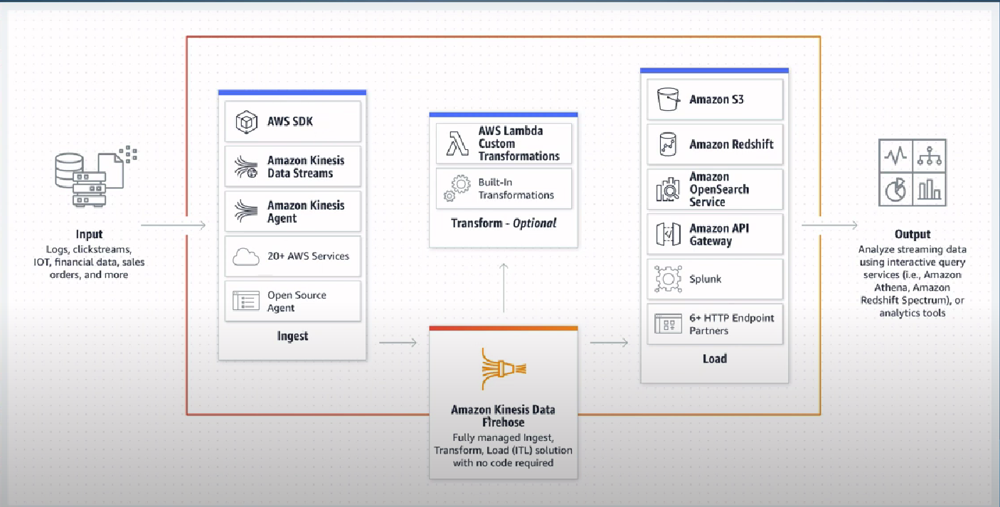
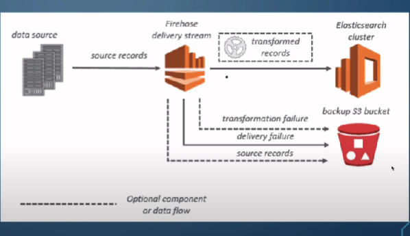

# Amazon Kinesis 
make it easy to collect, process and analyze real-time, streaming data so you can get timely insights and react quickly to new information 

### Kinesis Family 
-  Kinesis Video Streams
    - (Video Stream, analystics, ML)
-  Kinesis Data Streams
    - (Data Stream, real-time)
-  Kinesis Data firehose
    - (Capture, transform, load into stores, near-real-time)
-  Kinesis Data Analysis
    - (Process, sql, real-time)

### SHARD - Kinesis Data Stream
- Streams are divided into shards
- A shard has a sequence of data records in a stream
- it serves as a base throughput unit of a kinesis data stream
- A shard supports 1 MB/Second and 1,000 records per second for writes and 2 MB/second for reads.

### Shard opertions 
- Shard splitting 
    - split shard into two or more shards
- shard merging 
    - merge two or more shards into one shard 
- ReSharding takes a few seconds 
- we cann't scale up or down too quickly 

> search for image for this 

### Kinesis Data Stream 

### Kinesis Producers 
- Kinesis SKD (low level API)
- Kinesis Producer Library (KPL)
- Kinesis agent installed on a server to send files to Kinesis Stream
- Third party libraries 
    - Apache spark 
    - Kafka 
- Managed AWS sources that can send data into Kinesis data Stream 
    - Cloud watch logs 
    - IoT
    - Kinesis data analytics 

###  Kinesis SDK - Producer 

- send data using:
    - putRecord (sends one record per http request)
    - putRecords (sends many records per Http request)
        - Uses batching and increase throughput (less http requests)
- if you got over the limit of the request size (1 MB/s per shard) you get ProvisionedThrouputExceeded Exception 

### Kinesis Producer Library - KPL

- C++ or Java - High level functionality, SDK encapsulation 
- Support retry mechanism: it handles provisionedThrouputException by default 
- Sends metrics to CloudWatch 
- Doesn't support compression, need to be implemented by user
- Sends data synchronous or Asysnchronous API(Caching)
    - Kinesis KDS Supports Synchronous API
- Supports batching (sending a batch of records at once in one request) reduce cose and imporve throughput
- Batching 
    - Collection 
        - Write records tom multiple shards in the same PutRecords Http Request
    - Aggregation
        - Aggregate data while total size < 1 MB wait to receive more data and write it later into the same record wait time controlled by RecordMaxBufferedTime(100ms)

### Kinsis Agent
- Java Application that works only on linux servers
- Monitor log files and send them to kinesis data stream 
- iti is built on top of KPL so it has the retry mechanism and sending metrics to cloudWatch for monitoring 
- it can write to multiple streams 
- can do some preprocessing (format transformation) before sending data to the stream (csv to json, log to json)

---

## Kinesis Consumers
- Kinesis SDK (low level)
- Kinesis Client Library KCL (decode records sent by KPL)
- Kinesis consumer Enhanced Fan-out
- Kinesis Firehose
- Lambda
- 3rd party Library: Spark, Flume, Kafka, ...

## Kinesis Client Library KCL 
- KCL helps you consume and process data from kinesis data stream and taking care of many of the complex tasks associated with distributed computing, these include load balancing across multiple consumer application instances, responding to consumer application instance failures, checkpointing processsed records, and reacting to resharding. The KCL takes care of all of these subtasks so that you can focus your efforts on writing your custom record-processing login 
- it can read 2 mb/s shard or 5 API Calls (getRecords())

---
## Kinesis Firehose
- Amazon Kinesis Data firehose is an extract, transform, and Load (ETL) service that reliably captures, transform, and delivers streaming data to data lakes, data stores and analytics services.

- Store data in its target destination using batch write which is more efficient but doesm't happen at real time

- Data stored in:
    - S3 
    - redshift (data is written to S3 first, then using copy command to Redshift)
    - Amazon OpenSearch service
    - 3rd Party apps like datadog, splunk, mongodb
    - Custom desinations using HTTP endpoint

### Amazon Kinesis Firehose: How it works 

1. Ingest 
Configure you data producers(see below) to send data to Kinesis Data Firehose.

2. Transform (Optional)
Transform source records using an AWS Lamda function (by using exsiting lamda function or creating you custom one). You can also convert the record format.

3. Load 
Deliver data to specified desinsttion including Amazon S3, Amazon OpenSearch Service. Amazon RedShift. and Various Http endpoint destination.

### Kinesis Firehose (delivery stream)
- Support multiple data formats 
- Compression: 
    - For S3 destination:
        - Data conversion from Json to parquet/ORC
        - GZIP, ZIP and SNAPPY
    - for redshift destination 
        - GZIP 
- Transforming source records is done using lambda Ex:csv to Json 
- Spark and KCL don't read from KDF, they only read from Kinesis data stream.

- if data transformation is enabled, you can optionally back up source data to another Amazon S3 bucket 

### Kinesis Firehose - Buffer size 
- firehose accumlates records in a buffer
- the buffer is flushed based on time and size rules 
    - Buffer size (ex: 16mb) if the buffer size is reached, it is flushed.
    - Buffer time (ex: 2 minutes): if that time is reached, it's flushed
- Note that in circumstances where data delivery to the destination is falling behind data ingestion into the delivery stream, Amazon Kinesis Data firehose raises the buffer size automatically to catch up and make sure that all data is delivered to the desitnation