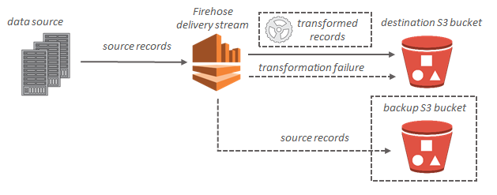
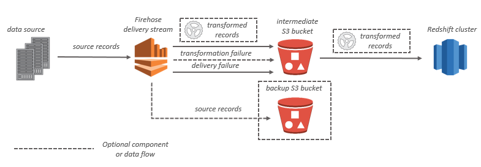

# What Is Amazon Kinesis Data Firehose?
Amazon Kinesis Data Firehose is a fully managed service for delivering real-time streaming data to destinations such as:
- Amazon Simple Storage service (Amazon S3)
- Amazon Redshift
- Amazon OpenSearch Service
- Splunk 
- any custom Http endpoint of 3rd party 

## Key Concepts

### Kinesis Data Firehose delivery stream
You use Kinesis Data Firehose by creating a Kinesis Data Firehose delivery stream and then sending data to it.

### Record
the data interest that your data producer sends to a kinesis Data firehose delivery stream, A record can be as large as 1 mb

### Data producer
- Producer send records to Kinesis data firehose delivery streams. 
- ex: a web server that sends log data to a devliery stream is a data producer

### Buffer size and buffer interval 
Kinesis Data Firehose buffers incoming streaming data to a certain size or for a certain period of time before delivering it to destinations. Buffer Size is in MBs and Buffer Interval is in seconds.

--- 
## Data Flow

- **For Amazon S3 desinations**, streaming data is delivered to your S3 bucket. if data transformation is enabled, you can optionally back up source data to another Amazon S3 bucket.

### Amazon RedShift desinations
- streaming data is delivered to your s3 bucket first
- Kinesis Data firehose then issues an Amazon Redshift copy command to load data from your S3 bucket to your Redshift cluster
- if data transformation is enabled, you can optionally backup source data to antother Amazon S3 bucket 

### OpenSearch desinations 
- Streaming data is devlivered to your opensearch service cluster
- it can optionally be backed up to your S3 bucker concurrently 

### Splunk desinstaion 
- Streaming data is delivered to Splunk and it can optionally be backed up to your S3 bucket concurrently 

