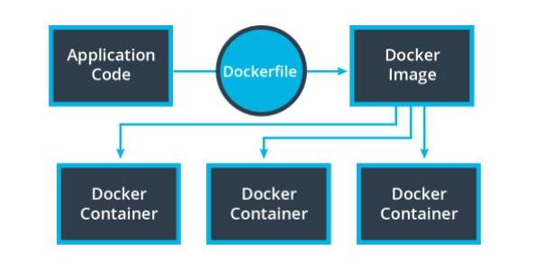
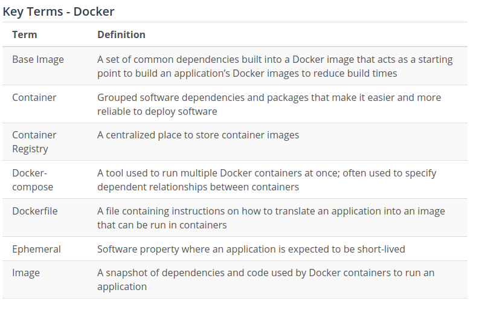
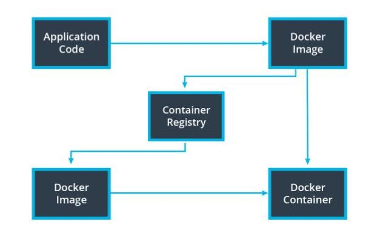
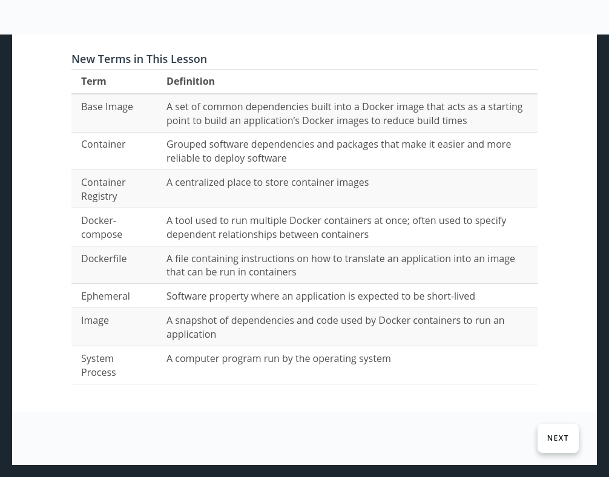

# Why Use Containers?

## Your Code is Not a Black Box...Yet

- pplications often require many packages and dependencies to run properly
- It’s common for an application to work on one computer but not another

## Deployment Headaches
- Organizations often have different development environments. These often include development and production.
- Deploying and testing the same code across different environments can be cumbersome
- In practice, it’s difficult to keep a development and production environment perfectly synchronized with regards to their versions, operating systems, dependencies, etc.
- It is common for code to work in a development environment and not behave as expected in production

# Introducing Containers

## The Container
- Simplify the deployment process.
- Code is bundled with everything it needs 
- Easier to deploy 
- Easier to debug

## Your Code is Now Kind of a Black Box
 - Containers are self-contained applications with all the dependencies needed to run
 - Containers can be treated as one unit of deployment
 - Rolling back code with containers is simply re-deploying an older snapshot

## Why Kind of?
- Containers make things easier but don’t magically make deployment problems disappear
- Code may still work in one environment and fail in another, though now we have an understanding of what might have failed

### Containers are Ephemeral
- Containers should be stateless and are expected to be destroyed.

### Containers Help Manage Dependencies
- Each container can be running its own versioned software. We resolve the issue where different applications may have different dependencies.

### Simplify Deployment
- Containers are self-contained so deployment is simply swapping out an existing container with a new one.

# Docker 
Docker is a platform that helps us manage the process of creating and managing our containers.

## Docker Image
When we have an application that we want to deploy, we can package it into a Docker Image. The image contains all of your code and dependencies.
## Docker Container
A Docker Container is an ephemeral running instance of a Docker Image.

## Dockerfile
A Dockerfile defines the steps to create a Docker Image.

### Sample Dockerfile
# Use NodeJS base image
    FROM node:13

    # Create app directory in Docker
    WORKDIR /usr/src/app

    # Install app dependencies by copying
    # package.json and package-lock.json
    COPY package*.json ./

    # Install dependencies in Docker
    RUN npm install

    # Copy app from local environment into the Docker image
    COPY . .

    # Set the API’s port number
    EXPOSE 8080

    # Define Docker’s behavior when the image is run
    CMD ["node", "server.js"]

## Basic Commands:

    - docker build . will run the Dockerfile to create an image
    - docker images will print all the available images
    - docker run {IMAGE_ID} will run a container with the image
    - docker ps will print all the running containers
    - docker kill {CONTAINER_ID} will terminate the container

[best Pracices for writing docker files](https://docs.docker.com/develop/develop-images/dockerfile_best-practices/)

[Docker Command Line](https://docs.docker.com/engine/reference/commandline/cli/)

## Debugging Containers

### Development
Troubleshooting Docker Containers is different as we lose access to some of the development tools can use for debugging.

### Viewing Logs

    docker logs

### Attaching to a Container

    docker exec -it sh

### View Docker Processes

    docker ps

### View Details of Docker Objects

    docker inspect

### New Term
 - System Process : A computer program run by the operating system

## Why might a container work in a local environment but not in a deployed environment?

- Docker is programming language agnostic so it doesn't matter which programming language you use
- Security restrictions can cause problems because we often have to interface with other resources and the permission we use locally, may be different than in the deployed environment
- System resouces are also important to ensure we have all of the resources that an application needs to run
- Credentials can also be problematic as you deploy code from a local environment to a deployed environment

## Advanced Debugging

We can also attach to the Docker container using the exec command:

    docker exec -it {CONTAINER ID} sh

We can use the shell inside the container to urn many different Linux commands. For example, we can see all of the running processes with

    ps aux

You return to the local terminal using exit

Note: you may not always be able to attach to the container if it is in a restricted environment. 

# Container Registries
- A container registry serves as a centralized place to store and version images.
- [Docker hub](https://hub.docker.com/) is a popular container registry run by the same organization that created Docker.

## Creating and Using a DockerHub Repository
- In DockerHub, create a new repository and set it to Public
- In your terminal, login to DockerHub
    > docker login --username={YOUR USERNAME}
- Tag your local image with the repository name:
    > docker tag {LOCAL IMAGE NAME} {USERNAME}/{REPOSITORY NAME}
- Push the image to DockerHub
    > docker push {TAGGED IMAGE}

### Container registries serve as a centralized source of our docker images

## Base Images
- Bundles the steps that are repeated in multiple builds into a pre-built package
- Base images reduce time that it takes to run redundant operations
- Uses the FROM keyword in Dockerfile, e.g. FROM node:13

- [Docker Registry](https://docs.docker.com/registry/)
- [Best practices for speeding up builds](https://cloud.google.com/cloud-build/docs/speeding-up-builds)

### Why Do We Need a Unique ID?
We often reference Docker images by specifying the latest image, but having a unique identifier helps a lot with Docker images. 

- We can reference a specific build
- Can revert to an older version

Example: An Application Requires an Older Version of Node.js

I worked on an application where we needed to deploy an older build because deploying with the latest version of the Node.js would actually break the application.

Using the ID, we were able to access the specific Docker image with the older verison of Node that we needed.

My Strategy
Step 1: Create a base image:

1. Take the the block of code that installs the NodeJS dependencies and save it as a new Dockerfile (see below)

2. Build the Docker image and name it slow-node-base

3. Create a DockerHub repository for slow-node-base

4. Tag slow-node-base and add it to the DockerHub registry

    >docker tag slow-node-base <YOUR_DOCKER_HUB>/slow-node-base
    docker push <YOUR_DOCKER_HUB>/slow-node-base

Step 2: Use the base image in our application image.

    Take a new copy of the starter Dockerfile and remove all of the code to install the dependencies, leaving only the custom logic of the application

    Use the base image we just created by linking it using the FROM command:

    FROM <YOUR_DOCKER_HUB>/slow-node-base:latest

    Build the new image.

    docker build -t slow-node .

Notice how much more quickly the image is built since we essentially removed the overhead of installing NodeJS!

## Best Practices for Modifying Containers
- Docker images should be considered a single unit of deployment. 
- You shouldn't be editing code or making changes to the system at all in a container. 
- If something is broken, you build a new image and deploy that to a new container.

