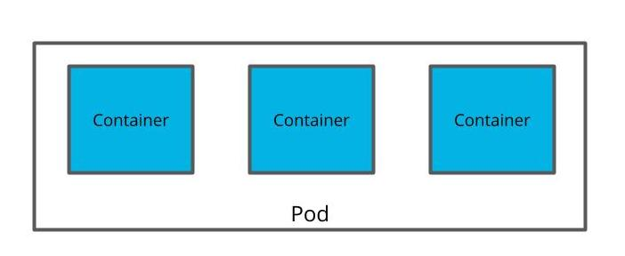
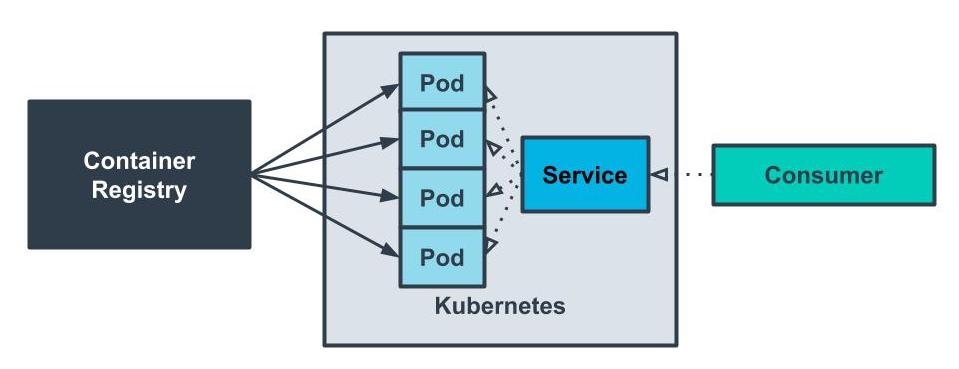
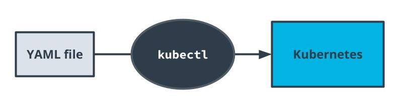

# Service Orchestration With Kubernetes

## Orchestration 
Automated handling of complicated workflows, it could help
- deploying code
- recovering from failure
- Scale horizontally

### Orchestration is the automated management of the lifecycle of our application
- With CI/CD, if Travis is our CI tool, then Kubernetes is our CD tool
- Orchestration helps us handle complicated workflows in deploying our application
- Helps us automate our deployment process for continuous deployment

---
## Fundamentals of Kubernetes

### Key Points

### **Kubernetes**
- A container orchestration system packed with features for automating our application's deployment
- Enables us to easily scale our application and ship new code
  
### **Pods**
- Containers often need to communicate with one another. It's not uncommon to see a deployment involving a few containers to be deployed.
- Kubernetes pods are abstractions of multiple containers and are alo ephermeral
  
### **Services**
- Applocations are often deployed with multiple replicas. This helps with load blanacing and horizontal scalling
- Services are an abstraction of a set of pods to expose them through a network




A service is an abstraction of pods and pods are abstractions of containers


## New Terms
|Term|Description|
|---|---|
|Horizontal Scaling|Handling increased traffic by creating additional replicas so that traffic can be divided across the replicas|
|Kubernetes Service|An abstraction of a set of pods and interface for how to interact with the pods|
|Pods|A set of containers that are deployed together|
|Load Balancing|Handling traffic by distributing it across different endpoints|
|Replica|A redundant copy of a resource often used for backups or load balancing|
|Consumer|An external entity such as a user or program that interfaces with an application|

### Additional Reading

The following are some additional resources for learning more details about service orchestration:
- [Container Wars](https://codefresh.io/containers/age-container-wars/)
- [Kubernetes Documentation](https://kubernetes.io/docs/home/)
- [Round Robin Load Balancing](https://www.nginx.com/resources/glossary/round-robin-load-balancing/)
- [Docker with Kubernetes](https://www.docker.com/products/kubernetes)


### What the purpose of wrapping a pods as a service?
- Wrapping a pod as a service is something you do for abstraction so it doesn't affet the cost 
- users shoul not care about when pods are destroyed because pods are ephemeral and they can be destroyed whenever
- Creating a pod doesn't noticeably affect kubernates performance

---
## Configuring Kubernetes

### Key Points
- AWS EKS is a service that we can use to set up kubernetes.
- The `deployment.yaml` file is used to specify how our pods should be created
- The `service.yaml` file is used to specify how our pods are exposed/

### deployment.yaml
```
apiVersion: apps/v1
kind: Deployment
metadata:
  name: my-app
  labels:
    app: my-app
spec:
  replicas: 2
  selector:
    matchLabels:
      app: my-app
  template:
    metadata:
      labels:
        app: my-app
    spec:
      containers:
      - name: simple-node
        image: YOUR_DOCKER_HUB/simple-node
        ports:
        - containerPort: 80
```

### service.yaml
```
apiVersion: v1
kind: Service
metadata:
  name: my-app
  labels:
    run: my-app
spec:
  ports:
  - port: 80
    protocol: TCP
  selector:
    run: my-app
```


Docker images are loaded from the container registry into Kubernetes pods. Access to the pods are exposed to consumers through a service.

### Why YAML Files?
- YAML does not make our code faster because setting up infrastructure is different than programming application logic. 
  - YAML does not make our code faster because setting up infrastructure is different than programming application logic. 
  - YAML files are used to specify configurations.
- Kubernetes is not written in YAML
- Kubernetes uses YAML doesn't care whether or not you're using Travis CI
- YAML is a great way to define our configurations because it is simple an efficient


--- 
## Loading YAML files

`kubectl apply` - create deployment and service

### Introductory Commands
`kubectl` provides a wide range of commands to interact with Kubernetes. The following are some basic commands that we can use to interact with our current cluster.

- **kubectl get pods** - show the pods in the cluster
- **kubectl describe services** - show the services in the cluster
- **kubectl cluster-info** - display information about the cluster


We will be interfacing with our Kubernetes cluster with the Kubernetes command-line tool kubectl. The YAML files that we created will be loaded through this tool.

### New Term
|Term|Description|
|---|---|
|Cluster| A group of resources that are connected to act as a single system |

### Best practice for Handling sensitive Strings
- we shouldn't manually encrpyt our sensitive strings. we don't want to do things that kubernetes cantake care of .
- we don't want manually enter sensitive strings because manual intervention defeats the purpose of automation. and for security reasons, we should not have access to an enterprise production environment to manually make changes
- We don't need to write a script to inject values in the pods because Kubernetes can already do it for us.
- Using Kubernetes secrets is a great way to store sensitive information. When we use deployments in Kubernetes, we can set values as Kubernetes secrets so that they're protected from the end user


---
## Alternative Deployment Strategies
Kubernetes is one solution for deploying your containers. It's packed with features but can sometimes be overwhelming. As we've mentioned before, choosing a tool comes with its own set of tradeoffs. Here are a few other popular technologies that are used in the industry today.

- **AWS ECS** -  AWS proprietary solution that predates AWS EKS. It integrates very well with other AWS tools and is a bit more straightforward as it is not as feature-packed as Kubernetes.
- **AWS Fargate** - AWS tool that helps streamline deploying containers to ECS and EKS.
- **Docker** - n option to simply run the container manually with Docker. Sometimes, it's tempting to pick a shiny hot tool that may lead to over-engineered architectures.

--- 
To attach to a container in a pod, we can use the following command:

> kubectl exec -it {pod_name} sh

This is a powerful tool that allows us to run and test commands directly inside the context of our pods.

Similar to the command that we used with Docker, we don’t want to rely on this command for modifying the code or state that’s running inside of the pod. The command should only be used for troubleshooting. Pods are ephemeral and we should create a new image to address any changes.

--- 
## Glossary 

|Term|Description|
|---|---|
|Cluster|A group of resources that are connected to act as a single system|
|Horizontal Scaling|Handling increased traffic by creating additional replicas so that traffic can be divided across the replicas|
|Kubernetes Service|An abstraction of a set of pods and interface for how to interact with the pods|
|Pods|A set of containers that are deployed together|
|Load Balancing|Handling traffic by distributing it across different endpoints|
|Replica|A redundant copy of a resource often used for backups or load balancing|
|Consumer|An external entity such as a user or program that interfaces with an application|


