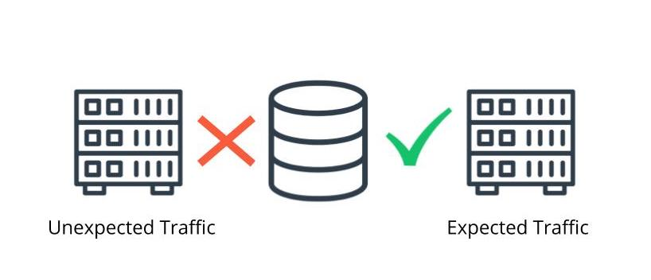
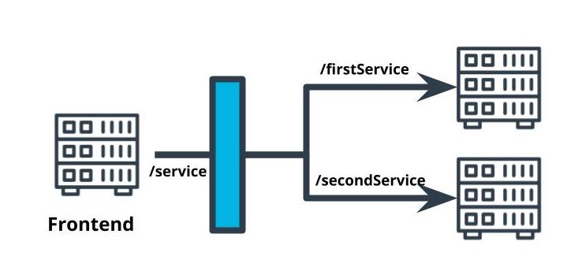
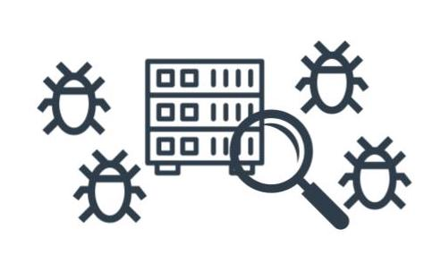

# Best Practice/Design Patterns for kubernetes

## Configuring Your Cluster
Kubernetes has configurations that can be tuned to optimize your deployed application.


### Cost
- Configure the resources and replicas for our deployed applications 

### Security
- Configure who has access to the Kubernetes pods and services
- Secure traffic for least-privilege

--- 
## Thinking about Production
### Production-ready
Deployed applications for production-use are different than ones we use for development. We have to make additional considerations as the application is no longer running in our isolated environment.

### Ristrict Access
- Follow properties of least privilege to secure our application 
  
### Scale 
- Be able to handle the number and size of user requests
  
### Availiability
- Ensure that the application is responsive and able to be used when needed
  


Use Least Privileged Access to Secure the Application


--- 
## Use a Reverse Proxy to Direct Backend Requests

### Reverse Proxy
- A single interface that forwards requests on behalf of the client and appears to the client as the origin of the responses
- useful for abstracting multiple microservices to appear as a single resource.

## API Gateway
- A form of a reverse proxy that serves as an abstraction of the interface to other services.

## Sample Reverse proxy
- Nginx is a web server that can be used as a reverse proxy. Configurations can be specified wha tn `nginx.conf` file.
- Sample bare-bones `nginx.conf` file"

```
events {
}
http {
  server {
      listen <PORT_NUMBER>;
      location /<PROXY_PATH>/ {
          proxy_pass http://<REDIRECT_PATH>/;
      }
  }
}
```

A reverse proxy proxy is used to route traffic from one endpoint to multiple endpoints

--- 
## Library vs API Gateway
both libraries an API Gateways are used to reduve the complexity of applications by removing boilerplate code and duplicate logic.

### Libraries
- Contains common code that must be imported into our service
- Need to make sure versions are consistent
- Limited to one programming language

### API Gateways
- Code and common logic is limited to inputs and outputs so we can't use logic that happens inside of another microservice
- Only need to implement the logic once
- Has its own technology stack so can use more than one programming language

--- 
## Securing the Microservices
This is not an all-inclusive list of things to do for securing your application. It means that while some of these are best-practice, there's no guarantee that these steps will ensure your application is perfectly secure.

- AWS security groups - enables you to restrict the inbound and outbound traffic for AWS resources.
- Kubernetes Ingress and Egress - enables you to restrict the inbound and outbound traffic for Kubernetes resources.


### Key Terms - Securing Microservices
|Term|Definition|
|---|---|
|Ingress|Inbound web traffic|
|Egress|Outbound web traffic|

- [OWASP Secure Coding Practices](https://owasp.org/www-project-secure-coding-practices-quick-reference-guide/migrated_content)
- [What is Penetration Testing?](https://www.cloudflare.com/learning/security/glossary/what-is-penetration-testing/)


--- 
## Configuring Scalable and Resilient Applications

### Self-Healing
Kubernetes deployments can be set up to recover from failure.
- Health checks - an HTTP endpoint that must return a 200 response for a healthy status. Kubernetes will periodically ping this endpoint.
- Replicas - Kubernetes will attempt to maintain the number of desired replicas. If a pod is terminated, it will automatically recreate the pod.

### Horizontal Scaling with Kubernetes
A deployment feature that allows additional pods to be created when a CPU usage threshold is reached.

### Commands
- Create HPA
```
kubectl autoscale deployment <NAME> --cpu-percent=<CPU_PERCENTAGE>                --min=<MIN_REPLICAS>
--max=<MAX_REPLICAS>
```
- View HPA
```
kubectl get hpa
```
### New Terms

|Term|Description|
|---|---|
|Horizontal Pod Autoscaler (HPA)|A Kubernetes deployment feature that allows additional pods to be created when a CPU usage threshold is reached.|
|Liveness Probe|A monitoring activity that occurs at scheduled intervals to ping a health check API endpoint to validate that the application is in a healthy state.|
|Resilience|The property of an application to handle and recover from failures.|

- [Kubernetes Health Check Best Practices](https://cloud.google.com/blog/products/gcp/kubernetes-best-practices-setting-up-health-checks-with-readiness-and-liveness-probes)


### Why Choose Horizontal Scaling over Vertical Scaling with Microservices?

- Horizontal scaling is not more performant than vertical scaling. Horizontal scaling and vertical scaling are different techniques to achieve the same goal. 
- Vertical scaling is compatible with reverse proxies. Reverse proxies don't care whether we use vertical or horizontal scaling because the pods are abstracted behind a service.
- Horizontal scaling is more cost effective because servers are subject to diminishing returns: the more we improve the performance of a single server, the more it will cost.

---
## Use Logs to Capture Metrics for Debugging
### Key Points
- Software is rarely free of errors so we need to troubleshoot errors when they occur.
- In production environments we don't have tools like breakpoints that could help us identify bugs
- Logging can get complicated so we need tools to handle logs and make it easy to search them.
- System logs used for debugging are sometimes different from error messages returned by API's.

### Strategies for Logging
- Use timestamps to know when the activity occurred
- Set a consistent style of logging to make it easier to parse log output
- Use process IDs to trace an activity
- Rotate logs so they don't fill up your storage
- Include stack traces in your logs
- Look at the delta in message timestamps to measure execution time
  


Logs are important for helping us troubleshoot microservices

- [Best Practices for Monitoring](https://docs.aws.amazon.com/AWSEC2/latest/UserGuide/monitoring_best_practices.html)
- [Best Practices for Monitoring](https://netflixtechblog.com/scalable-logging-and-tracking-882bde0ddca2?gi=227c03a261e1)
- [Designing a Logging Strategy](https://docs.oracle.com/cd/E19424-01/820-4806/fyfcv/index.html)


### Execution Time of an API Request
Imagine that there are multiple requests per second hitting the same API endpoint. Our load balancer will distribute these requests to a replicas. Since replicas are running the same Docker images, they'll produce very similar logs as they execute the same line of code. If we look at our logs, it'll be hard to determine which line belongs to which request.

To alleviate this, we can assign a unique ID at the beginning of the request and use that ID to identify the activityfrom beginning to end.


