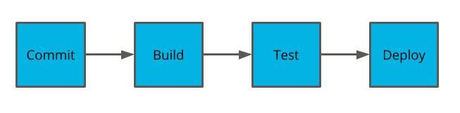
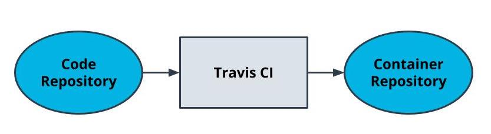
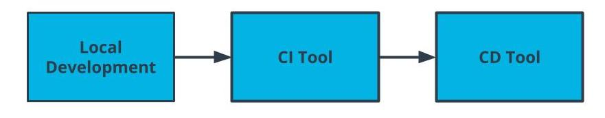

# Deployment Pipelines

## Understanding Deployment Pipelines
- We now have industry standards and tools for how we can deploy our code.
- Docker containers simplify what we deploy.
- Deployment pipelines simplify how we deploy Docker containers.
- Code is often deployed multiple times to different environments to validate functionality and minimize bugs.
- Deployment pipelines enable us to have an automated process that is reliable and reproducible.




## Code After Coding
Once your code is done, how do you ship it? Typically, the software development cycle will proceed with building the code, installing all of the dependencies, running automated tests, manually testing, and then repeating for each development environment the application needs to be deployed to.

- It’s a common fallacy to underestimate the time it takes to deploy code.
- Teams deploying enterprise software often involves many internal and external dependencies that may include: infrastructure changes, security changes, permissions provisioning, load testing


## CI/CD Benefits

### Continuous Integration 
process in which code is tested, built into a docker image, and deployed to a container registry.

### Coninuous Deployment 
Process in which our Docker image is deployed to containers

### Additional Benefits

By streamlining our build and deploy to an automated process, developers are provided the least privilege that they need to write their code.


CI/CD enables us to have a streamlined process for how our code transforms from being written to being deployed to production.


## Key Terms - CI/CD
| Term | Defination |
| --- | --- |
| Continuous Integration | practice of streamlining developer code to a centralized source |
| Continuous Deployment | practice of streamlining how code is released |
| Least Privileged Access | providing the least amount of permissions necessary |


[Ship Early and Often](https://blog.ycombinator.com/tips-ship-early-and-often/)

### Why do non-technical individuals at a business care about using CI/CD?
- CI/CD allows for a tight feedback loop 
- Bugs are inevitable -- CI/CD helps us identify them in a deployed environment 
- CI/CD makes the pipeline more available 


---

By using a CI/CD pipeline, we reduce the risk of failed deployments from user error. All of these steps can become automated. If there's an issue with the deployed code, a user ca revert the changes with an older container rather than backtracking by using older code  and downgrading packages and dependencies.

- Reduce risk of failed deployments 
- Connecting to a production environment is security risk 
- Backing up the code is not always a comprehensive backup of the existing state since we may have other dependencies such as database
- Packages and dependencies may have to be downgraded and would introduce downtime
  
---
## Travis CI

### Using Travis for Continuous Integration
- Travis is a tool that helps us with the CI process
- Travis integrates with your application using a YAML file.
- YAML files are often used to specify configurations
- Travis can be used to build and push images to DockerHub

### YAML
YAML is smiliar to how JSON is also used as representation of data but YAML is considered more readable.
- YAML is generally suited for configuration files 
- YAML is generally suited for expressing data

when used as connfigurations, they are often interchangeable. the examples below show how YAML file can be represented as JSON.

```
{
    “course_name”: “Making More Microservices”,
    “num_students”: 10,
    “lessons”: {
        “ci”: {
            “num_students”: 6
         },
        “cd”: {
        “num_students”: 4
        }
    }
}
```

```
course_name: Making More Microservices
num_students: 10
lessons:
  ci:
    num_students: 6
  cd:
    num_students: 4
```

### Travis File
the Travis file is always named ` .travis.yml ` and stored in top-level of your git directory. This is detected by Travis CI and turned into a build pipeline.

```
language: node_js
node_js:
  - 13

services:
  - docker

# Pre-testing installs
install:
  - echo "nothing needs to be installed"

# Scripts to be run such as tests
before_script:
  - echo "no tests"

script:
  - docker --version # print the version for logging
  - docker build -t simple-node .
  - docker tag simple-node YOUR_DOCKER_HUB/simple-node:latest

# Tasks to perform after the process is successful. Formatting the Docker username and password as below enables you to programmatically log in without having the password exposed in logs.
after_success:
  - echo "$DOCKER_PASSWORD" | docker login -u "$DOCKER_USERNAME" --password-stdin
  - docker push YOUR_DOCKER_HUB/simple-node
```

> 

    What about this code? echo "$DOCKER_PASSWORD"

    Don't worry if it isn't clear yet. $DOCKER_PASSWORD and $DOCKER_USERNAME are environment variables. We'll learn more about them soon!




Travis CI serves as the Continuous Integration component of our pipeline.


### New Term 
|Term| Defination|
|---|---|
|YAML|Yet another markup language a common way to programmatically write configurations. Sometimes referred to as YML.|


[Travis CI Features](https://docs.travis-ci.com/user/for-beginners/)


## Using Environment Variables with Travis

### Environment Variables
Environment variables are a useful way to handle variables that shouldn’t be hard-coded into our application. These values are often credentials that shouldn’t be stored in the code.


### Environment Variables with Travis
Travis provides a way to set environment variables without having them exposed. These values will be used during the Travis build process.

1. In your TravisCI dashboard, navigate to a repository
2. Navigate to the settings Screen
3. Set Values in Evironment Variables
   


Different phases of our software development lifecycle can take advantage of environment variables. Travis, our tool for CI, enables us to set environment variables on a per-repository basis in the settings.


[Best Practices in Securing Your Data](https://docs.travis-ci.com/user/best-practices-security/)

## Key Points

One strategy is to utilize the master branch for when your code is in a ready state. Use a separate branch while your code is still in active development and before it’s ready to be built into a Docker image. This provides flexibility in how we configure our build process: we can have different branches that Travis won’t automatically build and can have different environment variables configured for different branches.


## Alternative CI/CD Tools

### Travis is only one of many tools used for continuous integration.
ocker is more-or-less the defacto standard for containers. Build tools, on the other hand, aren’t as standardized. Travis is one of many CI/CD tools that are popular. Other ones include Jenkins, CircleCI, AWS CodeBuild. You may choose one depending on your business needs.

- [Jenkins](https://jenkins.io/) - Most felxible but more overhead of setup
- [CircleCI](http.com/) - alternative to Travis CI with many competing features
- [AWS CodeBuild](https://aws.amazon.com/codebuild/) - integrates easily with other AWS tools
  


## Glossary

|Term|Definition|
|---|---|
|Continuous Integration|practice of streamlining developer code to a centralized source|
|Continuous Deployment|practice of streamlining how code is released|
|Least Privileged Access|providing the least amount of permissions necessary|
|YAML|Yet another markup language a common way to programmatically write configurations. Sometimes referred to as YML.|


