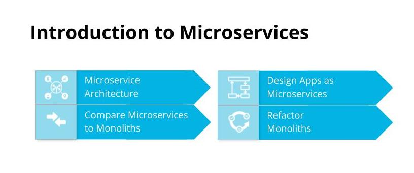
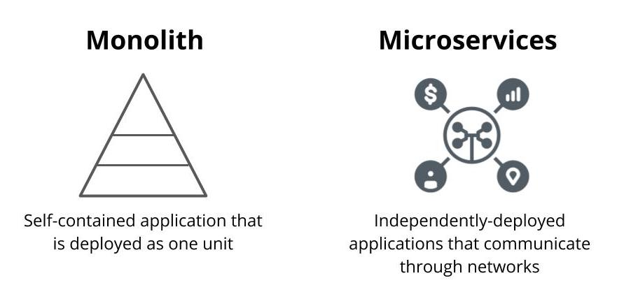
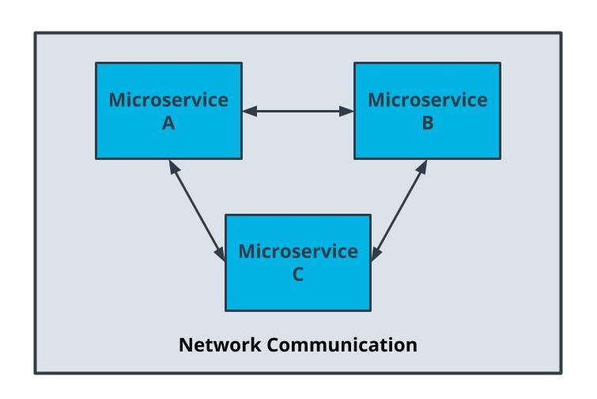
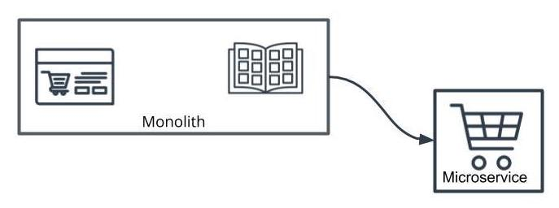
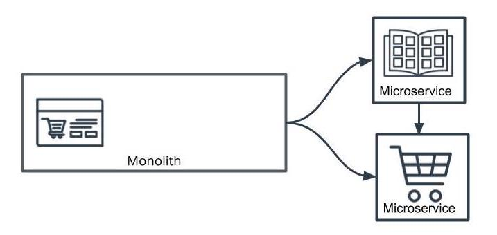
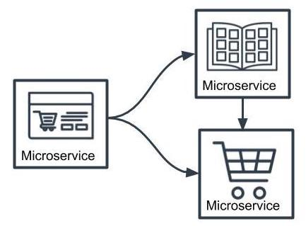
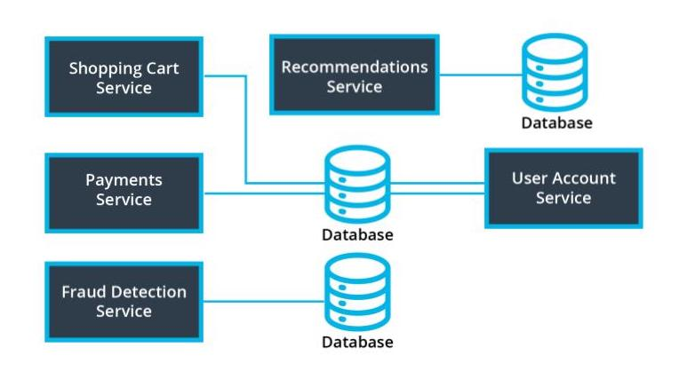
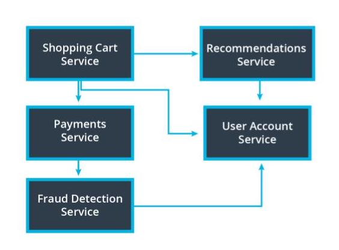
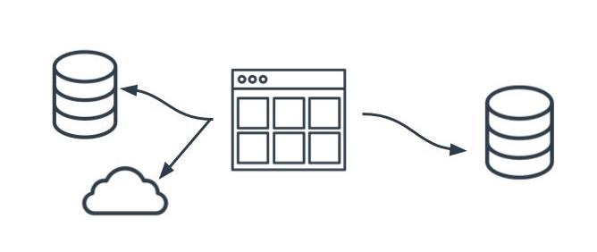

# Microservice principles 

## What are microservices?
Architectural style where our application is composed of modules that can be independently developed and deployed.

### Why Microservices?
- Reduced Complexity 
- Reduced risk 
- Easier to work in parallel
  
## Monoliths and Microservices 
- Microservices are an architectural style where an application is composed of modules that can be independently developed and deployed.
- In Monoliths, all the components of the application are build into a single application.
  
### Microservice Benefits
- Scale: lean applications that are able to trailor their logic and infrastructure to their specific bussiness needs. More easily architected for horizontally scalling.
- Development in parallel: Teams can develop and deploy their own codebases.
- Cost-Effectiveness: Utilize resources only for what is necessary for the specific microservice.
- Flexibility: Choose technologies that make the most sense for the team and business.

## Microservices Tradeoffs
Microservices benefits are not free!

Using Microservices requires extra time for set-up and managing the independent parts.

## Weighing the Benefits
Any application that can be built as a monolith can be built as a microservice but microservices
- Are harder to manage
- Take more investment to set up

We need to look at each scenario and examine each of these attributes to determine if microservices make sense:

    - Scale
    - Cost-effectiveness
    - Parallel development
    - Flexibilty

### Lone Developer
The costs of microservices may not outweigh the benefits:

    - Scale isn't an issue because this is a small project that isn't expected to grow in size
    - Parallel development isn't relevant because the developer is working alone

### Collaboration Between Data and Application Teams

Microservices can be very helpful in this scenario:

    - Each team has their own libraries that may be incompatible
    - Teams can work in parallel without significant dependencies

### Early Stage Start Up

Microservices are not a good choice:

    - Business requirements change frequently so the cost of setting up and managing microservices would be high
    - Parallel development takes a lot of valuable time and resources, which this team doesn't have because they need to move quickly

### Proof-of-Concept App

This is another case where the costs outweigh the benefits:

    - Only two developers so parallel development isn't a huge benefit
    - Development needs to be speedy so it doesn't make sense to consume that time setting up microservices

### Hobby Project with Limited Financial Resources

Using microservices doesn't save money so a monolith is a better choice:

    - Financial resources are limited
    - No need for parallel development or flexibility

# Microservice Architecture Designs

## Properties of Microservices

### Communication

- Services communicate through a network
- REST is currently the most-commonly used network interface

### Independently Deployed
- Deployment to one service should not affect another
  
### Fault tolerant
- Diligence in writing code that can anticipate when another microservice isn’t working

### Key Terms - Microservices

 | Term | Definition |
 |----- | ------------- | 
 | Rest | Architectural style of communication across a network |
 | Fault Tolerance | The ability to continue operating in the event of a failure|
 | Vertical Scaling | Scaling by increasing the capacity of existing machines|
 | Horizontal Scaling | Scaling by adding more machines|

 ### Alternatives to REST
 While REST is the most popular form of network communication used for microservices, there are many other protocols that can be used. The following are some other ways microservices can communicate with one another:

    Publish-Subscribe
    Queues
    gRPC
    SOAP
    GraphQL

## Divide a Monolith Application Into Microservices

### Map Your Dependencies

- It's important to understand the application you're working with before breaking it apart.
- One strategy is to map out the modules and their dependencies as a directed graph to understand the downstream impact of your changes.

### Where to Start?
- There’s no hard rule: choose the part of the application that makes the most sense to you.
- Dependency graph serves merely as a guideline on risk based on the number of dependencies.
- A module with the least dependencies will potentially have the downstream effects meaning less risk.

### How to Start?
- The Strangler pattern is a common and effective way to migrate legacy applications.
- Rather than replacing your code with a new version, you can gradually replace components of your application.
  

### Shared Code
- Code duplication can be abstracted into common libraries used across projects.

## Using the Strangler Pattern

## Key Terms - Refactoring
| Term | Defination |
|---- | ------- |
| Dependency Graph | A diagram that maps out the relationships between components to understand which parts of the system rely on the other | 
| Module | Program that is logically grouped together to execute a specific functionality | 
| Strangler Pattern | Strategy of refactoring code by incrementally replacing components of the codebase |
| Technical Debt | The concept of choosing an easier implementation of software that will need to be reworked |  

## using strangler pattern.

### Using a Dependency Graph
- Dependency graphs are one way to help us visualize and make an informed decision
- We often have to use additional context with regards to business functionality to weigh decisions
- Database complexity should also be considered for refactors. Services that seem simple may have complicated refactor strategies with their databases.

## Additional Considerations
### Summary
### Trade-Offs
Designing software is not a binary process. There's rarely a right or wrong answer and it's often a decision of balancing both technical and business tradeoffs.

Some trade-offs include

- Cost of Infrastructure
- Time of Development
- Managing Technical Debt

### Scope of Refactor
Microservices may not just be refactoring code. We also need to also consider other parts of the system including databases and infrastructure.

# Glossary 

| Term | Definition |
| --- | ---- |
| Dependency Graph | A diagram that maps out the relationships between components to understand which parts of the system rely on the other|
| Fault Tolerance | The ability to continue operating in the event of a failure |
| Horizontal Scaling | Scaling by adding more machines |
| Module | Program that is logically grouped together to execute a specific functionality |
| REST | Architectural style of communication across a network |
| Strangler Pattern | Strategy of refactoring code by incrementally replacing components of the codebase |
| Technical Debt | The concept of choosing an easier implementation of software that will need to be reworked |
| Vertical Scaling | Scaling by increasing the capacity of existing machines |