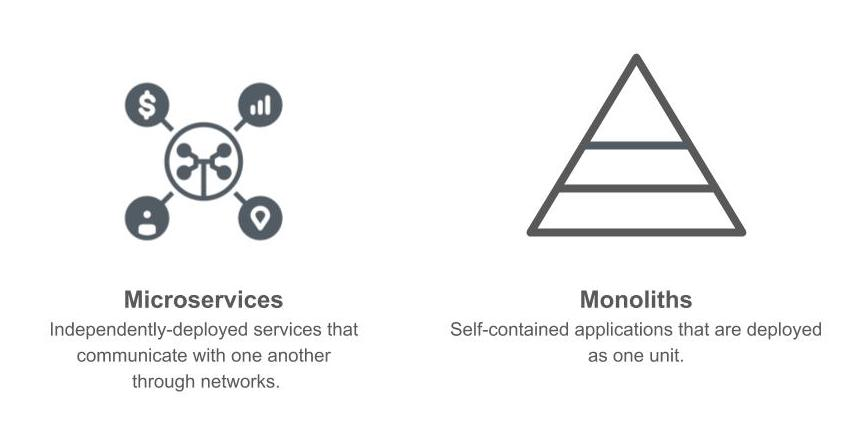
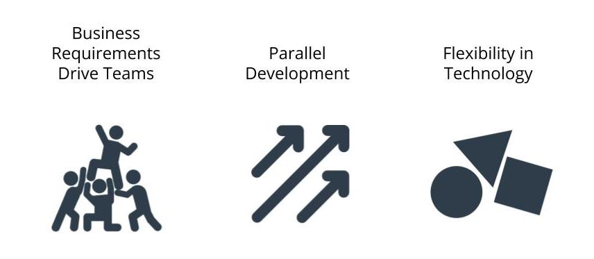

# Introduction to Microservices

## Monolith 
- Utilize a powerful, more costly machine
- Codebase is centrelized and easy to manage
- Code is easily shared across the project 
- Scoped for worst-case usage across all parts of the application 
  
## Microservice 
- Utilize smaller, cost effective machines for what we need
- Flexibility to implement logic in a way that makes sense for team and business 
- Learn to target specific business purpose
- Interfaces set up for building out other applications
- try not to overcommit and pay for resources that aren't needed

## What is deploying code ?
- Writing code is not enough -- it must also be deployed
- Deploying Code is the act of releasing code changes to an environment.

## Deploying Code is Not Easy
in a professional environment, deploying code is not always simply a code a paste operation. There's often an automated process that streamlines deployment of code.

When we deploy code, we need to consider the impact of factors including.
- Bugs and troubleshooting
- Downtime
- Ease of deployment
- Downstream effects including changes in expected behavior
  
# Business Value

### Microservices should be done with consideration to business decisions, and vice verse.

### Business Requirements Drive Teams
Teams can be organized around business need and have a clearer focus on customer requirements. There is clear ownership on who what.

### Teams can work in parellel 
Since projects are deployed independently, teams can develop and deploy code without stepping on each others toes.

### Flexibility in Technology
We are not limited to a certain technology and can choose what may work best for business need to team.

## The Pitfalls of Microservices
### Monoliths Are not bad 
Microservices designs are another architectural pattern are not intended to replace monolith applications. We should not blindly build applications as microservices without understanding the tradeoffs. Doing so cloud actually decrease productivity!

One way to think about this is to revisit our analogy with the sports Superstore. Does it make sense for every aspiring small business owner to open and manage multiple stores at once?

## Considerations for not using microservices

### System Complexity 
Rather than deploying a single application, we would deploying multiple modules separately. there is move overhead in setting up projects. 

### Network Latency 
By introducing a network between modules, we have increased latency in application performance and will find it harder to debug our application 

### Difficulty with Debugging 
we can no longer rely on a stack trace or tools that can help us pinpoint where a bug is. We may end up relying on logging to find causes of issues.

## The History of Delivering Software
### Release Cycles
oftware was often released a few times a year with large deployments. Now, containers and deployment strategies have made it possible to deploy multiple times a day with no downtime

### Team Stucture
Teams were organized around technologies rather than business requirements.
Teams may have previously consisted of separate teams for Quality Assurance, Database Administrators, and Designers. Now, we may have multi-skilled teams grouped together where all of these roles can be found in a single team.

### Hardware
Software was deployed to expensive mainframe computers located in data centers. Now, commodity hardware is powerful enough to run our applications. Distributed computing can help us perform large-scale data processing without the need to purchase dedicated, expensive hardware.

